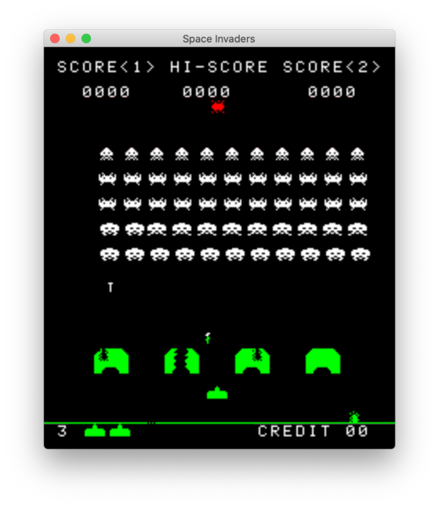

# space-invaders

[](https://github.com/dkim/space-invaders/actions?query=workflow%3Abuild+branch%3Amain)

space-invaders is an OpenGL-based emulator in Rust for the [Space Invaders]
arcade machine.

[Space Invaders]: https://en.wikipedia.org/wiki/Space_Invaders



## Installation Requirements

This program targets the latest stable version of Rust 1.56.1 or later.

### Requirements for Linux Systems

#### GLFW's Dependencies

This program uses the [`glfw-sys`] package (via the [`luminance-glfw`]
package), which compiles its own copy of the [GLFW] library. Compiling GLFW on
Linux requires [CMake] and some X11 development libraries to be installed. You
can install them on Debian-based distributions, as follows:

```console
$ sudo apt install cmake libxcursor-dev libxi-dev libxinerama-dev libxrandr-dev
```

The "[Compiling GLFW]" guide provides full details on how to compile GLFW.

[`glfw-sys`]: https://crates.io/crates/glfw-sys
[`luminance-glfw`]: https://crates.io/crates/luminance-glfw
[GLFW]: https://www.glfw.org
[CMake]: https://cmake.org
[Compiling GLFW]: https://www.glfw.org/docs/latest/compile.html

#### CPAL's Dependencies

This program uses [CPAL], a cross-platform audio library, via the [`rodio`]
package. On Linux, CPAL depends on the [`alsa-sys`] package, which requires
[pkg-config] and the ALSA development files to be installed. You can install
them on Debian-based distributions, as follows:

```console
$ sudo apt install pkg-config libasound2-dev
```

[CPAL's `README.md`] provides more information on its external library
dependencies.

[CPAL]: https://crates.io/crates/cpal
[`rodio`]: https://crates.io/crates/rodio
[`alsa-sys`]: https://crates.io/crates/alsa-sys
[pkg-config]: https://www.freedesktop.org/wiki/Software/pkg-config/
[CPAL's `README.md`]: https://github.com/RustAudio/cpal/blob/master/README.md

### Requirements for macOS Systems

Xcode contains all the necessary header files, libraries, and tools except for
[CMake]. You can install CMake via [Homebrew], as follows:

```console
$ brew install cmake
```

[Homebrew]: https://brew.sh

### Requirements for Windows Systems

Visual C++ with the "[C++ CMake tools for Windows]" and "[Windows 10 SDK]"
components contains all the necessary header files, libraries, and tools.

[C++ CMake tools for Windows]: https://docs.microsoft.com/en-us/cpp/build/cmake-projects-in-visual-studio?view=vs-2019
[Windows 10 SDK]: https://developer.microsoft.com/en-us/windows/downloads/windows-10-sdk

## Installation

```console
$ git clone https://github.com/dkim/space-invaders.git
$ cd space-invaders
$ cargo update  # optional
$ cargo build --release
```

## Usage

```console
$ cargo run --release -- --help
space-invaders 1.1.0
space-invaders is an emulator for the Space Invaders arcade machine.

USAGE:
    space-invaders <roms> [samples]

FLAGS:
    -h, --help       Prints help information
    -V, --version    Prints version information

ARGS:
    <roms>       A directory that contains invaders.{e,f,g,h}
    <samples>    A directory that contains {0..8}.wav

$ RUST_LOG=info cargo run --release -- /path/to/roms /path/to/samples
```

### Controls

| Key              | Description                                        |
| ---------------- | -------------------------------------------------- |
| <kbd>←</kbd>     | Move Left                                          |
| <kbd>→</kbd>     | Move Right                                         |
| <kbd>Space</kbd> | Fire                                               |
| <kbd>C</kbd>     | Insert a coin                                      |
| <kbd>T</kbd>     | Tilt the machine                                   |
| <kbd>1</kbd>     | Start a game in single-player mode                 |
| <kbd>2</kbd>     | Start a game in two-player mode                    |
| <kbd>F1</kbd>    | Number of lives: 3 (default) / 4 / 5 / 6           |
| <kbd>F2</kbd>    | Extra life at: 1000 points / 1500 points (default) |
| <kbd>F3</kbd>    | Pricing display: on (default) / off                |

## License

Licensed under either of

 * Apache License, Version 2.0
   ([LICENSE-APACHE](LICENSE-APACHE) or https://www.apache.org/licenses/LICENSE-2.0)
 * MIT license
   ([LICENSE-MIT](LICENSE-MIT) or https://opensource.org/licenses/MIT)

at your option.

## Contribution

Unless you explicitly state otherwise, any contribution intentionally submitted
for inclusion in the work by you, as defined in the Apache-2.0 license, shall
be dual licensed as above, without any additional terms or conditions.
